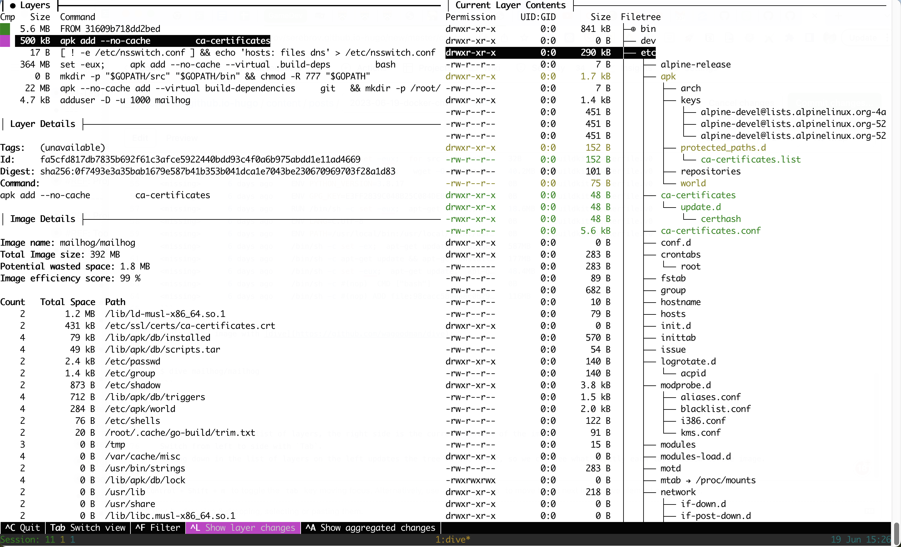

There are three useful tools to check the Docker image size and see what takes space:

- `docker image ls` - show images and sizes
- `docker image history image:tag` - show image layers and size for each layer
- [dive](https://github.com/wagoodman/dive) - a tool to inspect the image and see what each layer adds to the image

<!-- more -->

Check the image size with `docker image ls`:

```bash   
docker image ls

REPOSITORY            TAG            IMAGE ID       CREATED          SIZE
backend-ecs           test-master    1b433074c182   59 minutes ago   2.03GB
backend-ecs           latest         9095c4327d14   2 hours ago      2.03GB
backend-ecs           test           9095c4327d14   2 hours ago      2.03GB
main-frontend         latest         9a79643379d9   3 months ago     1.21GB
main-backend          latest         2817d422e2c2   3 months ago     1.33GB
postgres              13             b9c0a694b781   3 months ago     374MB
redis                 6.2.7-alpine   fd45e5a11a9d   6 months ago     27.1MB
postgres              14.2           9dbc24674f25   13 months ago    376MB
mailhog/mailhog       latest         4de68494cd0d   2 years ago      392MB
postgres              11.2           3eda284d1840   4 years ago      312MB
```

View image layers with `docker image history`:

```bash
$ docker image history backend-ecs:test

IMAGE          CREATED       CREATED BY                                      SIZE      COMMENT
9095c4327d14   2 hours ago   COPY /backend . # buildkit                      8.51MB    buildkit.dockerfile.v0
<missing>      2 hours ago   RUN /bin/sh -c pip install --no-cache-dir -r…   505MB     buildkit.dockerfile.v0
<missing>      2 hours ago   COPY backend/requirements.txt ./ # buildkit     5.06kB    buildkit.dockerfile.v0
<missing>      2 hours ago   RUN /bin/sh -c pip install virtualenv # buil…   15.6MB    buildkit.dockerfile.v0
<missing>      2 hours ago   RUN /bin/sh -c apt-get update -y && apt-get …   499MB     buildkit.dockerfile.v0
<missing>      2 hours ago   WORKDIR /backend                                0B        buildkit.dockerfile.v0
<missing>      6 days ago    CMD ["python3"]                                 0B        buildkit.dockerfile.v0
<missing>      6 days ago    RUN /bin/sh -c set -eux;   wget -O get-pip.p…   9.9MB     buildkit.dockerfile.v0
<missing>      6 days ago    ENV PYTHON_GET_PIP_SHA256=96461deced5c2a487d…   0B        buildkit.dockerfile.v0
<missing>      6 days ago    ENV PYTHON_GET_PIP_URL=https://github.com/py…   0B        buildkit.dockerfile.v0
<missing>      6 days ago    ENV PYTHON_SETUPTOOLS_VERSION=57.5.0            0B        buildkit.dockerfile.v0
<missing>      6 days ago    ENV PYTHON_PIP_VERSION=23.0.1                   0B        buildkit.dockerfile.v0
<missing>      6 days ago    RUN /bin/sh -c set -eux;  for src in idle3 p…   32B       buildkit.dockerfile.v0
<missing>      6 days ago    RUN /bin/sh -c set -eux;   wget -O python.ta…   40.2MB    buildkit.dockerfile.v0
<missing>      6 days ago    ENV PYTHON_VERSION=3.8.17                       0B        buildkit.dockerfile.v0
<missing>      6 days ago    ENV GPG_KEY=E3FF2839C048B25C084DEBE9B26995E3…   0B        buildkit.dockerfile.v0
<missing>      6 days ago    RUN /bin/sh -c set -eux;  apt-get update;  a…   18.6MB    buildkit.dockerfile.v0
<missing>      6 days ago    ENV LANG=C.UTF-8                                0B        buildkit.dockerfile.v0
<missing>      6 days ago    ENV PATH=/usr/local/bin:/usr/local/sbin:/usr…   0B        buildkit.dockerfile.v0
<missing>      6 days ago    /bin/sh -c set -ex;  apt-get update;  apt-ge…   587MB
<missing>      6 days ago    /bin/sh -c apt-get update && apt-get install…   177MB
<missing>      6 days ago    /bin/sh -c set -eux;  apt-get update;  apt-g…   48.4MB
<missing>      6 days ago    /bin/sh -c #(nop)  CMD ["bash"]                 0B
<missing>      6 days ago    /bin/sh -c #(nop) ADD file:98cacc5890a8c0b29…   116MB
```

Explore the image with [dive](https://github.com/wagoodman/dive):

```
$ dive mailhog/mailhog
```



The left side is the list of layers, the right side is the current content of the image.
Switch from left to side with `Tab`.
Moving down in the list of layers on the left updates the tree on the right, so we can see what exactly each layer added to the image.
