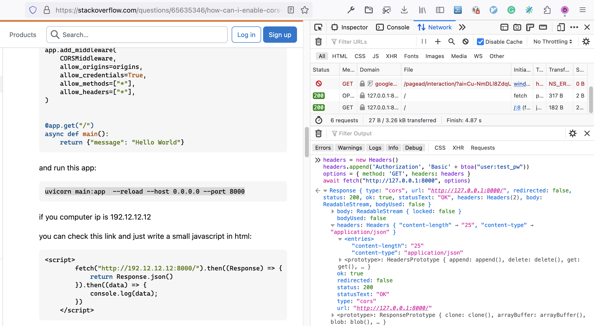
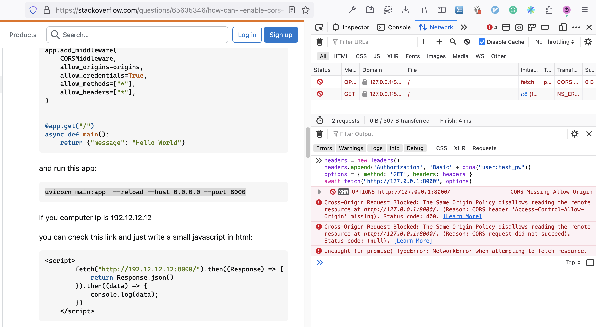

# Testing FastAPI CORS Settings

This is an example of testing [FastAPI](https://fastapi.tiangolo.com/) app [CORS](https://developer.mozilla.org/en-US/docs/Web/HTTP/CORS) settings to see how `allow_origins` (the [Access-Control-Allow-Origin](https://developer.mozilla.org/en-US/docs/Web/HTTP/Headers/Access-Control-Allow-Origin)) and `allow_credentials` (the [Access-Control-Allow-Credentials](https://developer.mozilla.org/en-US/docs/Web/HTTP/Headers/Access-Control-Allow-Credentials) header) [parameters](https://fastapi.tiangolo.com/tutorial/cors/) work practically.

We wanted to make sure that we do not need the `allow_credentials=True`. From the [docs](https://developer.mozilla.org/en-US/docs/Web/HTTP/Headers/Access-Control-Allow-Credentials) it looks like this is the case when we want to send cookies or auth headers from the server (which we do not do), although in our case we send auth headers from the client (the API auth token).

According to the docs, it should work like this:

* On the client set [Request.credentials](https://developer.mozilla.org/en-US/docs/Web/API/Request/credentials) to `include` (we do not do this and the default is `same-origin`)
* On the server: return cookies or auth headers (we do not do this) and add `Access-Control-Allow-Credentials` header

If we do only `1` and server does not set `Access-Control-Allow-Credentials` the request will not be returned to the javascript code.

I also tested this using a mini-app:

```python
"""
Run the app like this:
uvicorn test_app:app  --reload --host 0.0.0.0 --port 8000

Test it like this (in the browser console):
headers = new Headers()
headers.append('Authorization', 'Basic' + btoa("user:test_pw"))
options = { method: 'GET', headers: headers }
await fetch("http://127.0.0.1:8000", options)
"""
from fastapi import FastAPI
from fastapi.middleware.cors import CORSMiddleware

app = FastAPI()

origins = ["*"]

app.add_middleware(
    CORSMiddleware,
    allow_origins=origins,
    # allow_credentials=True,
    allow_methods=["*"],
    allow_headers=["*"],
)


@app.get("/")
async def main():
    return {"message": "Hello World"}
```

It works with `allow_credentials` line commented out:



I am testing this on the StackOverflow [page](https://stackoverflow.com/questions/65635346/how-can-i-enable-cors-in-fastapi), so the request goes from "stackoverflow.com" and is a CORS request.

If I comment out the `allow_origins=origins` line in the mini-app config, I get an error:


