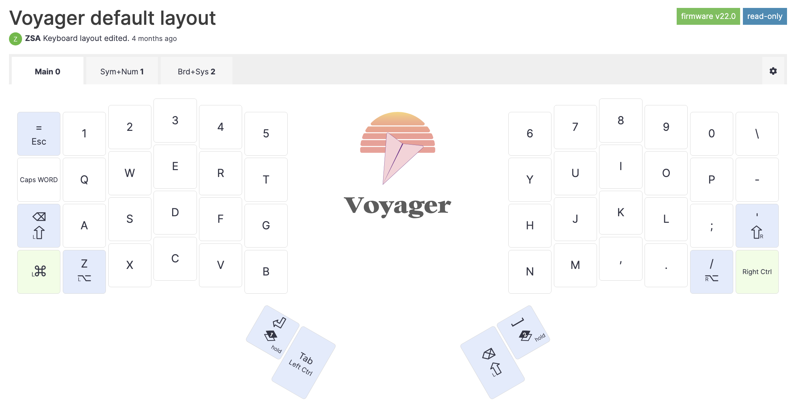

Traditional keyboards have a large spacebar that is available for both thumbs. On split keyboards, I often see the spacebar key only on one side - left or right.

But what is better? Should the spacebar be pressed by the left or right thumb? Or is it better to alternate thumbs?

A collection of links to touch typing tutors and games.

<!-- more -->

I was reviewing my [layout](https://configure.zsa.io/voyager/layouts/aldqO/latest/0) and I traditionally have two symmetrical spacebar keys on my layouts,
but most of ergo layouts I saw use one space with backspace or enter on the other side which is quite a win on small layouts (more functions are moved to thumb keys).

For example, [miryoku](https://github.com/manna-harbour/miryoku) has a spacebar on the left and backspace on the right:

And the [default Voyager layout](https://configure.zsa.io/voyager/layouts/default/latest/0) has a spacebar on the right and Enter on the left:

Searching for the information (sources are below), I found the following:
- DO NOT use index finger for space!!!
- Gamers prefer the left spacebar as right hand is busy with the mouse
- Some people prefer the left (or right for lefties) hand is usually more static, while the right often goes to the mouse or touch bar
- Some people prefer the right hand as it is dominant
- Argument for the right shift when using QUERTY: the layout is heavy on the left side and using the right sift balances it.

Ergonomically I think it is important to take health into account: space bar is one of the most popular keys and repeatedly using the same thumb for it may be bad in the long term.
Combining thumbs makes sense in this regard as this heavy load is spread between two fingers (maybe not evenly, but still).

So I will stick with two spaces for my layouts.

References:

- [Keyboarding Techniques.pdf](https://www.usd417.net/pages/uploaded_files/Keyboarding%20Techniques.pdf) - always use right thumb, never both and never alternate (no explanation though).
- [Should you use both thumbs for the space bar? : r/typing](https://www.reddit.com/r/typing/comments/vzu2l6/should_you_use_both_thumbs_for_the_space_bar/) - it does not matter
  - "[in terms of speed] It's not going to make a difference. it's single finger bigrams and words that the querty layout handles particularly badly. Eg "number"... right index finger, down, up, down for "num". Or "My" if you're a right-Y-striker, etc and so on. So starting to relearn some slow words with alternate fingering will more likely help your speed than alternating thumbs will. :)"
[Spacebar, left or right thumb? : r/typing)[https://www.reddit.com/r/typing/comments/i8vic9/spacebar_left_or_right_thumb/] - whatever, and QUERTY is heavy on the left hand
  - "Something to consider is that QWERTY is weighted to the left hand (~55% left, ~45% right for alphabetic characters)."
- [Both thumbs for typing? : r/typing](https://www.reddit.com/r/typing/comments/hlig3d/both_thumbs_for_typing/) - using only one thumb may injur it.
  - "I have a similar issue. I have been pressing the spacebar with my right thumb for the last 30+ years and it started to hurt recently."
- [Typesy | Touch Typing & Keyboarding Software & App](https://www.typesy.com/are-you-all-thumbs-touch-typists-say-yes/) - use both
  - "You’ll need to get into the habit of using both thumbs to hit the space bar, although most people generally use the thumb of their dominant hand for this key."
- [Which thumb is the proper one to hit the space bar, the left or the right? - Quora](https://www.quora.com/Which-thumb-is-the-proper-one-to-hit-the-space-bar-the-left-or-the-right) - various opinions:
  - left, because left hand is more stationary (right moves to backspace, mouse, etc)
  - left is also an answer gamers give (because the right hand is on the mouse)
  - other answers mention right and both thumbs
  - both: "I was taught touch typing (teacher, manuals, ...), back in the days where computers filled up whole rooms. So, mechanical typewriter. The instructions said, to use the thumb of the hand you did NOT use to type the previous letter."
- [Which thumb should press the spacebar, and when? - General - Colemak forum](https://forum.colemak.com/topic/1828-which-thumb-should-press-the-spacebar-and-when/)
  - Interesting question if using both thumbs:
    - Should I use the thumb of the hand opposite the hand entering the last letter of a word to hit the spacebar?
    - OR
    - Should I use the thumb of the hand opposite the hand entering the first letter of the next word to hit spacebar?
- [I've decided to switch back to QWERTY : r/dvorak](https://www.reddit.com/r/dvorak/comments/oxe15e/ive_decided_to_switch_back_to_qwerty/) - both feels good
  - "Also, having achieved a certain level using right-thumb-only space bar (which I had been for about 30 years lol), found that alternating is actually pretty cool kinetically and fairly simple to learn with Dvorak because you basically switch to left-thumb spacing, with the exception of the vowels + qjkxpy, and the rest just comes with feel and feels pretty normal."
